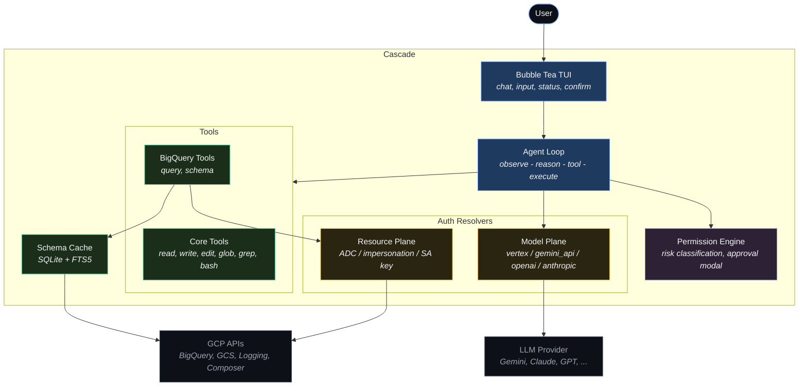

# Cascade

AI-native terminal agent for GCP data engineering. Think Claude Code, but for BigQuery, Airflow, dbt, and your entire GCP data platform.

## What It Does

Cascade is a conversational CLI that understands your data warehouse schema, pipeline dependencies, and cost profile. Ask questions in natural language, run queries with cost awareness, explore schemas, and diagnose issues — all from the terminal.

## Status

**Pre-alpha — actively developed.** Cascade is usable today for BigQuery workflows. Platform tools and multi-provider support are in progress.

### What's working

| Component | Status | Notes |
|-----------|--------|-------|
| Conversational TUI | Done | Streaming, markdown, trackpad scroll, sweep glow spinner |
| Core tools | Done | read, write, edit, glob, grep, bash |
| Permission engine | Done | Risk classification, approval modal, 3 modes |
| BigQuery query | Done | Execute SQL, dry-run cost estimation, cost guards |
| BigQuery schema | Done | Schema cache (SQLite + FTS5), explore, search, context injection |
| Cost tracking | Done | Per-query cost, session totals, budget warnings, `/cost` |
| SQL optimization hints | Done | Partition filters, clustering keys, expensive JOINs |
| Context compaction | Done | Auto at 80%, `/compact` manual trigger |
| One-shot mode | Done | `cascade -p "..."` for scripting |
| Gemini provider | Done | API key and Vertex AI |

### Roadmap

| Phase | Description | Status |
|-------|-------------|--------|
| TUI excellence | Input polish, streaming fixes, UX refinements | In progress |
| Cloud Composer | Airflow DAG inspection, task logs, trigger runs | Planned |
| Cloud Logging | Query logs, correlate with pipelines, tail live | Planned |
| GCS | Browse buckets, read objects, check pipeline artifacts | Planned |
| dbt integration | Model lineage, run/test commands, source freshness | Planned |
| Multi-provider | OpenAI, Anthropic (Claude) as LLM providers | Planned |
| Schema autocomplete | Tab completion for table/column names | Planned |

## Getting Started

### Prerequisites

- **Go 1.24+**
- **GCP credentials** (for BigQuery and other GCP tools):
  ```bash
  gcloud auth application-default login
  ```
- **LLM provider** — one of:
  - Gemini API key: `export GOOGLE_API_KEY="your-key"` (cheapest, recommended for testing)
  - Vertex AI: uses your GCP credentials automatically
  - OpenAI / Anthropic: coming soon

### Install

```bash
# From source
git clone https://github.com/yogirk/cascade.git
cd cascade
make build

# Or install directly
go install github.com/yogirk/cascade/cmd/cascade@latest
```

### Run

```bash
# Interactive mode
./bin/cascade

# One-shot mode
./bin/cascade -p "show me the largest tables in my project"
```

### Configure

Create `~/.cascade/config.toml`:

```toml
# LLM provider
[model]
provider = "gemini_api"  # gemini_api | vertex | openai | anthropic
model = "gemini-3-flash-preview"

# GCP platform access
[gcp]
project = "my-gcp-project"

[gcp.auth]
mode = "adc"  # adc | impersonation | service_account_key

# BigQuery
[bigquery]
datasets = ["my_dataset", "analytics"]  # Datasets to cache for schema-aware queries

# Cost controls
[cost]
warn_threshold = 1.0     # Dollar amount to prompt confirmation
max_query_cost = 10.0    # Dollar amount to block query
daily_budget_usd = 100.0 # Session budget warning at 80%

# Permission mode
[security]
default_mode = "ask"  # ask | read-only | full-access
```

Without a config file, Cascade auto-detects: `GOOGLE_API_KEY` for the LLM, ADC for GCP tools.

## Features

### Core
- Streaming conversational TUI (Bubble Tea v2 + Lip Gloss v2 + Glamour v2)
- Tool system: `read_file`, `write_file`, `edit_file`, `glob`, `grep`, `bash`
- Policy-first permission engine with risk classification
- Approval modal: allow once, allow tool for session, deny
- Session context compaction at 80% window usage (`/compact`)
- One-shot mode for scripting (`cascade -p "..."`)

### BigQuery
- `bigquery_query` — Execute SQL with automatic dry-run cost estimation; `dry_run=true` for cost-only
- `bigquery_schema` — Explore schemas: list datasets, tables, describe columns, FTS5 search
- Schema cache (SQLite + FTS5) populated from INFORMATION_SCHEMA, with `__TABLES__` fallback
- Schema-aware context injection for accurate natural language to SQL
- SQL optimization hints: missing partition filters, unused clustering keys, expensive JOINs
- Session cost tracking with budget warnings
- `/sync [dataset]` — Refresh schema cache on demand
- `/cost` — View session cost breakdown

### Auth
- Two independent auth planes: GCP resources + LLM provider
- GCP: ADC, service account impersonation, or key file
- LLM: Vertex AI (reuses GCP auth), Gemini API key, OpenAI, Anthropic
- Startup report shows what's available

### UX
- Ocean blue cascade branding with animated tilde spinner
- Sweep glow text effect and per-turn elapsed timer with token counts
- Welcome screen with connection dashboard (project, datasets, mode)
- Human-friendly model names in status bar (e.g., "Gemini 3 (Flash)")
- Custom markdown theme with borderless tables and alternating row dimming
- Trackpad scroll support
- `/help`, `/model`, `/compact`, `/sync`, `/cost` slash commands

## Architecture



## Development

```bash
make build      # Build binary to bin/cascade
make test       # Run all tests with race detector
make test-short # Run unit tests only
make lint       # Run go vet
make clean      # Remove build artifacts
```

## License

[MIT](LICENSE)
